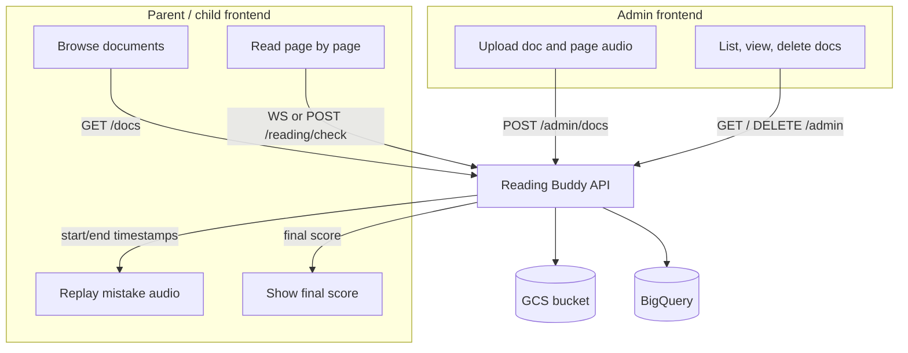

# Reading Buddy API

Backend for Reading Buddy: admins upload documents and page audio; children read page-by-page with speech-to-text feedback; the API replays correct pronunciation on mistakes and returns a final score when the book is finished.

## Quick links

| Audience | Start here |
|----------|------------|
| **Frontend (build everything)** | [Frontend architecture guide](docs/frontend/ARCHITECTURE.md) |
| **Frontend (quick index)** | [Frontend integration](docs/frontend/README.md) |
| **API reference** | [API overview](src/api/README.md) |
| **Architecture & storage** | [Architecture](docs/architecture.md) |
| **Local setup & deployment** | [Development](docs/development.md) |

## Live API docs

When the server is running:

- **Swagger UI:** `http://localhost:8080/docs`
- **Health:** `GET /health` → `{ "status": "ok" }`

## Base URL

| Environment | URL |
|-------------|-----|
| Local | `http://localhost:8080` |
| Production | Your deployed host (e.g. Cloud Run) |

WebSocket: `ws://localhost:8080/reading/session` (use `wss://` in production).

## Big picture



Details: [Architecture](docs/architecture.md)

## Documentation map

```
docs/
  architecture.md      # Backend system design
  development.md       # Env vars, run locally, Docker
  frontend/
    ARCHITECTURE.md    # ★ Frontend build guide (start here)
    README.md          # Quick route index
    flows.md             # Step-by-step UI flows (admin, WebSocket, POST)
    audio.md             # Audio encoding expectations
    errors.md            # HTTP + WebSocket errors

src/api/
  README.md            # Endpoint index
  admin.md             # POST/GET/DELETE /admin/*
  catalog.md           # GET /docs/*
  reading.md           # POST /reading/check, /reading/finish
  websocket.md         # WS /reading/session protocol

src/data/
  README.md            # Pydantic models & request/response shapes
```

## Endpoint cheat sheet

| App | Method | Path |
|-----|--------|------|
| Admin | `POST` | `/admin/docs` |
| Admin | `GET` | `/admin/docs`, `/admin/docs/{id}`, `/admin/docs/{id}/pages/{n}` |
| Admin | `DELETE` | `/admin/docs/{id}` |
| Child | `GET` | `/docs`, `/docs/{id}`, `/docs/{id}/pages/{n}` |
| Child | `POST` | `/reading/check`, `/reading/finish` |
| Child | `WebSocket` | `/reading/session` |
| Ops | `GET` | `/health` |

See [src/api/README.md](src/api/README.md) for payloads and responses.
