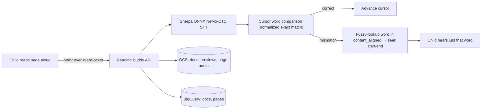

# AI Reading Buddy — POC Write-Up

**Product Engineer Assessment · Deliverable 2 of 2 · Short Write-Up**

A mobile-first web app that lets a child read a book aloud, page by page, while
self-hosted speech-to-text (STT) grades their reading word by word and plays back
the correct pronunciation of any word they miss. STT runs on our own server
(Sherpa ONNX on Cloud Run) — no cloud STT/LLM in the reading loop.

**Related docs:** [Architecture](architecture.md) · [Development](development.md) · [STT Evaluation](../eval/README.md) · [Stakeholder Eval Summary](STAKEHOLDER_EVAL_SUMMARY.md) · [Frontend guide](frontend/ARCHITECTURE.md)

---

## Section 1 · Research & Failed Trials

### Competitive research

I reviewed the leading English early-reading apps — **Ello** and **Google Read Along** — and pulled out three insights that shaped the POC:

- **Short feedback loops win.** The most successful apps rely on tight loops, animations, and audio cues, plus a "reading buddy" that drives quizzes and helps the child work through hard passages.
- **On-device speech recognition matters.** Read Along ships a speech-to-text model *inside* the Android app, which cuts latency and cost. This directly informed my decision to keep STT on our own infrastructure rather than calling a cloud API per utterance.
- **Design for two audiences.** Although the child is the primary user, these platforms are deliberately appealing to *parents* as well — the product has to feel trustworthy and rewarding to the adult who installs it.

### Technical research

- **Speech-to-text options.** Evaluated an Arabic **Wav2Vec2** checkpoint and NVIDIA NeMo's **FastConformer** for Arabic transcription.
- **Scoring approach.** Compared naive **fuzzy-match scoring** against **AI-based semantic scoring** for reading accuracy, and settled on cursor-based word alignment (see Section 2).
- **UI direction.** Collected candidate UI designs and analyzed them with Claude to pick the layout best suited to a mobile-first POC for young readers.

### Trials — choosing the STT model

I ran a small, controlled trial to pick the best STT model before building on top of it.

**1. Build a validation set.** 10 audio clips — a mix of book-sample narrations and real child recordings pulled from the teacher-scored evaluation spreadsheet.

**2. Define the metrics.**
- **Word Error Rate (WER)** — measures transcription errors against the reference phrase. Pass threshold: **WER < 20**.
- **Transcription latency** — total time to transcribe a fixed batch of **4 clips (≤ 9 s each)**, as a proxy for the live-reading UX.

**3. Results.**

| Model | WER | Time to transcribe 4 clips | Verdict |
|-------|-----|----------------------------|---------|
| Wav2Vec2 (Arabic) | **> 20** (above threshold) | **> 40 s** | ❌ Rejected — inaccurate *and* too slow for a live loop |
| FastConformer (NeMo) | **14** | **~6 s** | ✅ Selected — best on both accuracy and speed |

**Conclusion.** Wav2Vec2 failed on both axes: it exceeded the WER threshold and took over 40 seconds for 4 clips, which would break the recording → feedback → retry loop. FastConformer won decisively (WER 14, ~6 s), and its CTC head was exported to ONNX for optimized inference in production. The server loads this exported model via Sherpa ONNX's NeMo-CTC recognizer — `OfflineRecognizer.from_nemo_ctc(model="stt_ar_ctc.onnx", tokens="tokens.txt")` in [`src/utils/models.py`](../src/utils/models.py).

---

## Section 2 · Features & Decisions

### Included in the POC

- **Book library.** The child browses uploaded books with cover-preview images and titles, paginated from the API.
- **Page-by-page reading flow.** Each page shows its text (and an optional page image), Record / Stop controls, and a recording-state indicator. The next page unlocks only after the current page is complete.
- **In-browser voice recording.** Mic capture is encoded to WAV natively (no third-party recording SDK) and streamed to the server over WebSocket as base64.
- **Self-hosted STT.** The server transcribes each utterance with Sherpa ONNX (NeMo-CTC) — no Whisper and no cloud LLM in the reading loop. (Runs on our infrastructure, not literally on the child's device.)
- **Word-level accuracy check.** Child speech is compared to the page text via a session **cursor**: the heard word at position *i* is checked against the expected word at `cursor + i`, and the cursor advances through the run of consecutive correct words before the first mismatch. Matching is exact after normalization (NFKC, diacritics/tatweel and punctuation stripped, lowercased — `normalize_word` in [`src/utils/compare.py`](../src/utils/compare.py)). A mismatch returns feedback for the expected word, with retry or skip.
- **Per-word narrator replay.** On a mismatch, the child can hear *only that word* as the narrator pronounced it — the server looks up that word's `start`/`end` in the page's stored word timestamps (`content_aligned`) and returns them so the client seeks the reference audio. Full-page playback stays optional — it is not the default correction path.
- **Progress indicator.** Current page / total pages shown throughout the book.
- **Final score screen.** Accuracy %, words correct / total, pages completed, words retried correctly, and words skipped.
- **Admin panel.** Upload documents with per-page text + reference narration audio; list, inspect, and delete books.
- **Mobile-first UX.** Large tap targets, readable type, and a thumb-friendly record control.

### Left out (time constraints)

- **User accounts / reading history** — would require further backend modeling.
- **A real AI reading buddy** that personalizes the experience per child based on past interactions and history.
- **In-app animations / a character mascot** to improve retention — high impact but time-intensive to do well.
- **A friendlier admin panel** with lower-effort data entry.
- **Voice Activity Detection (VAD)** on the backend to strip background noise from child recordings and improve transcription quality.
- **Redis / better caching** to smooth the slow responses seen during page navigation.
- **Fixing the background-noise problem** end to end.

### Key product decisions

- **Sherpa ONNX STT over cloud Whisper/GPT pipelines.** Keeps transcription on our own infrastructure: predictable cost, no per-utterance LLM/STT API bill, and lower latency for the live reading loop — essential for a free-tier-friendly POC.
- **ONNX-runtime inference over the raw Hugging Face model.** Exporting to ONNX removed the overhead of the full research checkpoint and gave faster, lighter inference suitable for Cloud Run.
- **Word-level grading (session cursor) over page-level "Success / Try Again."** Comparison happens per word against the page text (`compare_utterance` in [`src/utils/compare.py`](../src/utils/compare.py)), so feedback pinpoints the exact mistaken word — the child is never told to "try the whole page again."
- **Per-word narrator replay on mismatch.** On failure, the server maps the expected word to its start/end timestamps in the page reference audio so the child hears *how that one word* is pronounced. The lookup is a **fuzzy match** (`difflib.SequenceMatcher`, threshold `STT_FUZZY_MATCH_THRESHOLD = 0.6`) that finds the right segment in `content_aligned` even when the transcript wording differs slightly. Full-page playback remains optional.
- **Normalization-based leniency in grading.** Grading normalizes both sides before comparing (diacritics, tatweel, and punctuation are stripped), so harmless orthographic differences don't block progress. (Phonetic/pronunciation-variant fuzzy grading is a planned improvement — today the fuzzy step is used only to locate the replay clip, not to grade.)
- **Skip word when stuck.** The session continues instead of trapping the child on one word; skips are tracked in the final score.
- **Single-tap Record / Stop (no press-and-hold).** Lowers the UX barrier for young children compared with a hold gesture.
- **WebSocket live session.** The server tracks cursor and score in real time, cutting round-trips versus a POST-only flow and smoothing the Record → feedback → retry loop.

---

## Section 3 · Measuring Success

### Primary metrics — is the product working?

| Metric | Definition | Target |
|--------|------------|--------|
| **Reading Accuracy Rate** | % of pages scored "Success" per session | **> 70%** average across users |
| **Session Completion Rate** | % of users who finish all pages of a book | **> 50%** (low = book too hard or UX friction) |
| **Retry Rate** | Avg retries per page | **< 2** (high on a specific page → simpler text / better narration needed) |
| **Return Rate (D1 / D7)** | % of children returning the next day / week | Strong signal for engagement and habit formation |

### STT & grading accuracy

We built an offline harness ([`eval/`](../eval/README.md)) that replays a **teacher-scored** dataset of real Arabic child clips through the exact production STT + grading path and compares verdicts. Run it with `python eval/evaluate_sherpa.py` and `python eval/visualize_eval.py`.

**What the first full run (922 clips) showed** — and the interactive breakdown in [sherpa-stt-eval canvas](/Users/mohamedaymankamel/.cursor/projects/Users-mohamedaymankamel-Desktop-projects-reading-buddy/canvases/sherpa-stt-eval.canvas.tsx):

- **Precision 92% / false-accept rate 9%** — the grader almost never says a wrong reading is fine. Good: kids aren't advanced past real mistakes.
- **Recall 48% / false-reject rate 52%** — but it often flags *good* reading as wrong. This is a **grading-methodology artifact**, not a transcription failure: the harness grades one pass from `cursor=0` and stops at the first mismatched word, so a single dropped leading phoneme collapses the whole utterance to 0%.
- **Takeaway** — this is exactly why production ships **retry, skip, and normalization**, and why the roadmap calls for **lenient/phonetic matching** and **VAD** to cut noise-driven first-word misses. The offline number is a conservative floor, not the child's live experience.

Ongoing:

- **Track false accepts / false rejects** as the headline pair. Target: **< 10%** on each (false accepts already there; false rejects are the work).
- **Tune fuzzy-match thresholds** and alignment vs. timestamps; A/B strictness to balance challenge against encouragement.
- **Spot-check per-word clip quality.** If start/end timestamps are off, kids hear the wrong syllable — treat clip accuracy as part of grading quality.

### User-experience signals

- **Drop-off page analysis** — which page do most kids quit on? Difficulty spike or UX issue.
- **Narrator clip play-through rate** — if kids ignore the word clip on retry, reconsider auto-play vs. tap-to-hear, or clip length.
- **Time-on-page / time-on-word** — unusually long "stuck" time may mean UI confusion, hard vocabulary, or STT failures.
- **Retry → success conversion** — after hearing the word clip, how often does the next attempt succeed?

### Cost metrics — free-tier viability

- **Infra cost per completed session** (Compute / Cloud Run + STT host), *not* per-LLM-call. Target: well under **$0.01 / session** once amortized.
- **Audio storage & bandwidth** (GCS reference WAVs + signed-URL traffic) as books and pages grow.
- **Monthly spend vs. active sessions** to set free-tier limits without a Whisper/Claude bill.

### Qualitative signals

- **Parent feedback (NPS):** "Would you recommend this to another parent?"
- **Teacher feedback:** measurable classroom reading improvement after 2–4 weeks of use.
- **Usability sessions:** watch 3–5 kids use the app live — no metric beats direct observation.

---

## Section 4 · Code Tour (start here)

A reading order for anyone opening the repo cold. Follow it top to bottom and you'll understand the whole request path.

### 0. Run / access it

| Environment | How |
|-------------|-----|
| **Production** | Cloud Run service `reading-buddy` (region `europe-west1`). Base URL: `https://<paste-your-run-url>` · Swagger at `/docs` · WebSocket at `wss://<host>/reading/session` |
| **Local** | `uv sync && uv run uvicorn main:app --reload --port 8080` → Swagger at `http://localhost:8080/docs` (see [development.md](development.md)) |

> Paste the live Cloud Run URL above — the deploy pipeline is in [`cloudbuild.yaml`](../cloudbuild.yaml).

### 1. Entry point → routers

- [`main.py`](../main.py) — FastAPI app, lifespan (loads STT model, GCS + BigQuery, starts the BQ pool), CORS, and mounts three routers: `/admin`, `/docs`, `/reading`, plus `GET /health`.

### 2. The reading loop (the heart of the product)

- [`src/api/reading.py`](../src/api/reading.py) — `POST /reading/check`, `/reading/skip`, `/reading/finish`, and the `WS /reading/session` handler (the live message loop).
- [`src/services/reading_session.py`](../src/services/reading_session.py) — the in-memory `ReadingSession`: holds the cursor, tallies score, applies retry/skip rules.
- [`src/utils/compare.py`](../src/utils/compare.py) — `normalize_word`, `tokenize_text`, `compare_utterance` (cursor grading), `fuzzy_match_segment_index` (locate the replay clip), `decode_audio_base64`.
- [`src/utils/models.py`](../src/utils/models.py) + [`src/utils/decode.py`](../src/utils/decode.py) — Sherpa ONNX recognizer load (`from_nemo_ctc`) and subword→word merging with timestamps.

### 3. Content ingestion (admin)

- [`src/api/admin.py`](../src/api/admin.py) — upload / list / inspect / delete / realign.
- [`src/services/stt_service.py`](../src/services/stt_service.py) — the workhorse: doc CRUD, transcribing reference audio at upload into `content_aligned`, and the reading-check logic that returns per-word `start`/`end`.

### 4. Storage & persistence

- [`src/services/storage_service.py`](../src/services/storage_service.py) — GCS upload/download/signed URLs (four prefixes).
- [`src/bq/`](../src/bq/) + [`src/schemas.json`](../src/schemas.json) — BigQuery client pool and the `docs` / `pages` table schemas.
- [`src/config.py`](../src/config.py) — all tunables (STT threads, frame duration, fuzzy threshold, BQ pool sizing).

### 5. Evaluation (how we know it works)

- [`eval/evaluate_sherpa.py`](../eval/evaluate_sherpa.py) — replays the teacher dataset through `eval/sherpa_core.py` (a copy of production grading) → `sherpa_eval_results.csv`.
- [`eval/visualize_eval.py`](../eval/visualize_eval.py) — scatter, Bland–Altman, error histogram, confusion matrix, baseline comparison. Interactive version: [sherpa-stt-eval canvas](/Users/mohamedaymankamel/.cursor/projects/Users-mohamedaymankamel-Desktop-projects-reading-buddy/canvases/sherpa-stt-eval.canvas.tsx).

### Suggested 10-minute walkthrough path

`main.py` → `src/api/reading.py` (WS handler) → `reading_session.py` → `compare.py::compare_utterance` → `stt_service.py` (upload alignment + `start/end` lookup) → `eval/` for the numbers.

---

## Appendix · How it fits together



At upload, each reference page audio is transcribed once and its **word timestamps** are stored (`content_aligned`). While reading, the child's utterance is transcribed and compared to the stored page text from a per-session cursor; on a mismatch the server returns the `start` / `end` of the expected word so the client can replay exactly that word. Full technical detail lives in [architecture.md](architecture.md) and the [STT evaluation harness](../eval/README.md).

### As-built implementation reference

Everything below is verified against `src/`, so the write-up and the code stay in sync.

**STT model** — Sherpa ONNX **NeMo-CTC** offline recognizer, `stt_ar_ctc.onnx` + `tokens.txt`, loaded from `MODEL_DIR` ([`src/utils/models.py`](../src/utils/models.py)). Child audio arrives base64-encoded, is decoded with `soundfile`, and resampled to 16 kHz ([`src/utils/compare.py`](../src/utils/compare.py), [`src/services/stt_service.py`](../src/services/stt_service.py)).

**HTTP + WebSocket routes** ([`src/api/`](../src/api/)):

```text
GET    /health
POST   /admin/docs                                   # upload doc: per-page text + base64 reference audio
GET    /admin/docs/{offset}/{limit}                  # list
GET    /admin/docs/{doc_id}                           # inspect
GET    /admin/docs/{doc_id}/pages/{page_number}
DELETE /admin/docs/{doc_id}                           # delete (BigQuery + GCS cleanup)
POST   /admin/docs/{doc_id}/realign                   # re-run STT alignment
POST   /admin/docs/{doc_id}/pages/{page_number}/realign
GET    /docs/{offset}/{limit}                         # child catalog (paginated)
GET    /docs/{doc_id}
GET    /docs/{doc_id}/pages/{page_number}
POST   /reading/check                                 # POST-only grading of one utterance
POST   /reading/skip                                  # advance cursor past a stuck word
POST   /reading/finish                                # finalize POST-flow score
WS     /reading/session                               # live grading session
```

**WebSocket protocol** ([`src/api/reading.py`](../src/api/reading.py)):

| Direction | `type` | Purpose |
|-----------|--------|---------|
| client → server | `start` | Begin session `{ doc_id, page_number? }` |
| client → server | `audio` | Send `{ data: "<base64>" }` (also the retry mechanism) |
| client → server | `skip` | Skip the pending mismatched word |
| client → server | `next_page` | Advance to next page |
| client → server | `end` | End session, receive final score |
| server → client | `page` | Page text/image after `start` / `next_page` |
| server → client | `ok` | Utterance correct, page not finished |
| server → client | `feedback` | Mismatch: `{ mismatches[] (with start/end), cursor }` |
| server → client | `page_complete` | Page done (not the last) |
| server → client | `score` | Final score payload |
| server → client | `error` | Error |

The server tracks the cursor and running score server-side (`ReadingSession`, [`src/services/reading_session.py`](../src/services/reading_session.py)).

**Final score fields** (`FinalScoreResponse` and WebSocket `score`): `doc_id`, `words_total`, `words_correct`, `words_skipped`, `words_retried_correct`, `pages_completed`, `pages_total`, `accuracy` (= `words_correct / words_total`).

**Storage** — one GCS bucket with four prefixes (`docs/{id}.{ext}`, `previews/{id}.png`, `page_images/{id}/{n}.png`, `audios/{id}/{n}.wav`) and two BigQuery tables (`docs`, `pages`; page word timestamps live in `pages.content_aligned`). See [`src/services/storage_service.py`](../src/services/storage_service.py) and [`src/schemas.json`](../src/schemas.json).

### Notes on scope (write-up vs. code)

- **"Next page unlocks only after the current page is complete"** is enforced as **client UX policy**; the API will honor an early `next_page` if the client sends one.
- **"WAV natively in-browser"** is a client/docs convention — the backend accepts any `soundfile`-decodable base64 audio, not strictly WAV.
- **Redis/caching and VAD** are genuinely *not* in the codebase yet (correctly listed under "Left out").
- The code also ships **`realign` endpoints** (re-run STT alignment for a doc/page) that the feature list above doesn't mention.
