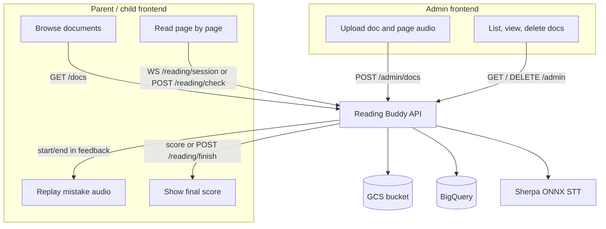

# Architecture

## System overview

## Code layout

| Path | Role |
|------|------|
| [`main.py`](../main.py) | FastAPI app, lifespan, CORS, routers |
| [`src/api/`](../src/api/) | HTTP + WebSocket route handlers |
| [`src/services/stt_service.py`](../src/services/stt_service.py) | Doc CRUD, STT alignment, reading checks |
| [`src/services/storage_service.py`](../src/services/storage_service.py) | GCS upload/download/signed URLs |
| [`src/services/bootstrap.py`](../src/services/bootstrap.py) | Create BigQuery tables on startup |
| [`src/utils/compare.py`](../src/utils/compare.py) | Word grading, fuzzy alignment |
| [`src/utils/models.py`](../src/utils/models.py) | Sherpa ONNX recognizer helpers |
| [`src/bq/`](../src/bq/) | BigQuery client pool and table operations |
| [`src/schemas.json`](../src/schemas.json) | BigQuery table schemas |

## Storage

### GCS (single bucket, two prefixes)

| Object path | Source |
|-------------|--------|
| `docs/{doc_id}.{ext}` | `InsertDocReq.content` (base64 decoded) |
| `previews/{doc_id}.png` | First-page PNG rendered on upload |
| `page_images/{doc_id}/{page_number}.png` | Per-page PNG rendered on first reader/catalog request (hybrid cache) |
| `audios/{doc_id}/{page_number}.wav` | `InsertPageReq.audio` (base64 decoded) |

### BigQuery

| Table | Key fields |
|-------|------------|
| `docs` | `id`, `title`, `ext`, `pages_number`, `gcs_uri`, `preview_gcs_uri` |
| `pages` | `id`, `doc_id`, `page_number`, `content`, `audio_gcs_uri`, `content_aligned`, `image_gcs_uri` |

Schema definitions: [`src/schemas.json`](../src/schemas.json).

## Grading model

1. **At upload** — reference page audio is transcribed; word timestamps are stored in `content_aligned` as a JSON string. Admin-provided `text` is stored as `content`.
2. **While reading** — child utterance is transcribed; words are compared against `content` from a session **cursor**.
3. **On mismatch** — server maps the expected word to a timestamp in `content_aligned` (index match, then fuzzy match) and returns `start` / `end` so the client can seek the page reference audio.
4. **Scoring** — WebSocket sessions tally `words_correct` / `words_total` server-side; `POST /reading/finish` accepts client tallies for the POST-only flow.

Details: [Reading API](../src/api/reading.md) · [WebSocket](../src/api/websocket.md)

## Startup

On application lifespan:

1. Load STT model, GCS client, BigQuery indices.
2. Create `docs` and `pages` tables if they do not exist.
3. Start the BigQuery query pool.

See [Development](development.md) for required environment variables.
