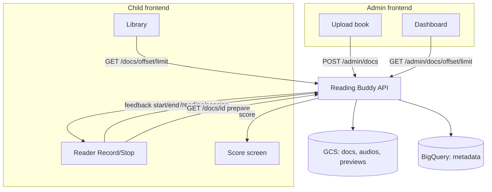
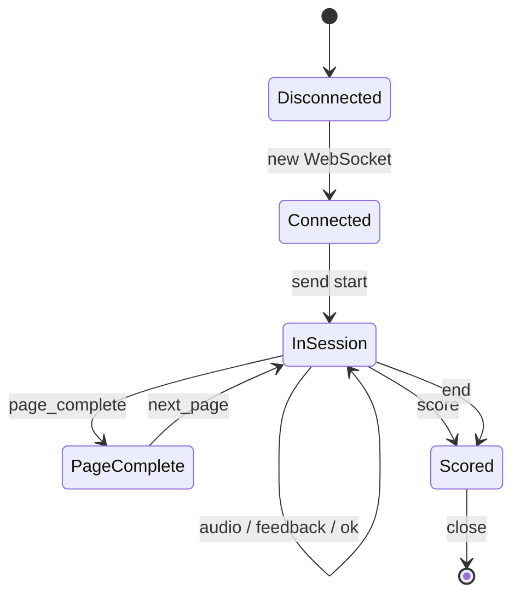
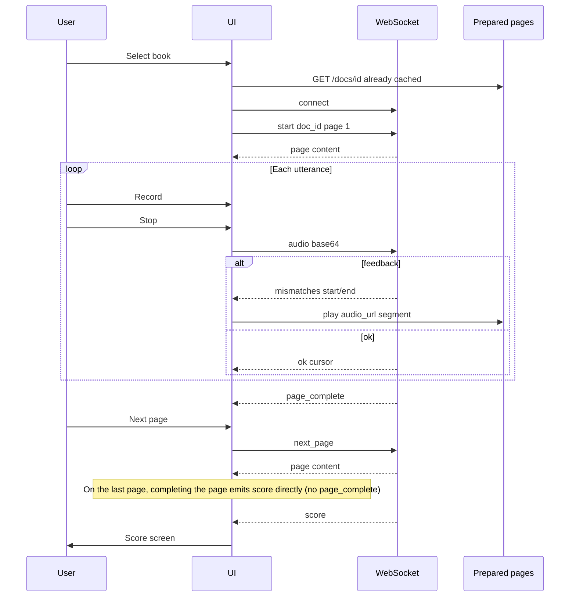

# Frontend architecture guide

Complete reference for building the **admin panel** and **parent/child reading app** on top of the Reading Buddy API.

Use this document as your single source of truth. Supplementary docs: [flows](flows.md) · [audio](audio.md) · [errors](errors.md) · [API details](../../src/api/README.md)

---

## 1. What you are building

Reading Buddy has **two separate frontends** talking to one backend:

| App | Users | Purpose |
|-----|-------|---------|
| **Admin panel** | Teachers / content managers | Upload books (document + per-page text + reference audio), list, inspect, delete |
| **Child / parent app** | Child reads; parent may supervise | Browse library, open a book, read aloud page-by-page, get pronunciation help on mistakes, see a final score |

There is **no authentication** in the current API. Both apps call the same host; route prefixes separate admin (`/admin`) from public catalog (`/docs`).

---

## 2. System overview



### What the backend stores (relevant to UI)

| Asset | GCS path | Exposed to frontend as |
|-------|----------|------------------------|
| Original document | `docs/{doc_id}.{ext}` | `content_url` (signed, ~60 min) |
| First-page preview image | `previews/{doc_id}.png` | `first_page_image_url` on library cards |
| Page reference audio | `audios/{doc_id}/{page_number}.wav` | `pages[].audio_url` on doc detail |

| Metadata | BigQuery | Used for |
|----------|----------|----------|
| Title, page count, extension | `docs` | Library cards, navigation |
| Page text | `pages.content` | Display + grading |
| Word timestamps | `pages.content_aligned` | Server-only; client gets `start`/`end` on mistakes |

---

## 3. Connection

### Base URLs

| Environment | HTTP | WebSocket |
|-------------|------|-----------|
| Local | `http://localhost:8080` | `ws://localhost:8080/reading/session` |
| Production | `https://your-host` | `wss://your-host/reading/session` |

### Headers

- `Content-Type: application/json` for all POST bodies
- No auth headers required (MVP)

### CORS

Backend reads `CORS_ORIGINS` (default `*`). In development:

```bash
export CORS_ORIGINS="http://localhost:3000"
```

### Health

`GET /health` → `{ "status": "ok" }` — use for app startup checks.

### Interactive OpenAPI

Swagger UI is at **http://localhost:8080/docs** (exact path). The catalog API lives under the same prefix with extra segments (`/docs/{offset}/{limit}`, `/docs/{doc_id}`, …) — do not confuse Swagger with the library list.

---

## 4. Screen map

### Admin panel

```
┌─────────────────┐     ┌─────────────────┐     ┌─────────────────┐
│  Dashboard      │────▶│  Upload wizard  │     │  Doc detail     │
│  paginated list │     │  file+pages     │     │  pages preview  │
└─────────────────┘     └─────────────────┘     └─────────────────┘
```

| Screen | API calls |
|--------|-----------|
| Dashboard | `GET /admin/docs/{offset}/{limit}` |
| Upload | `POST /admin/docs` |
| Doc detail | `GET /admin/docs/{doc_id}`, optional per-page `GET .../pages/{n}` |
| Delete | `DELETE /admin/docs/{doc_id}` |

### Child app

```
┌─────────────────┐     ┌─────────────────┐     ┌─────────────────┐     ┌─────────────────┐
│  Library        │────▶│  Prepare        │────▶│  Reader         │────▶│  Score          │
│  cards + pager  │     │  cache audio    │     │  WS + Record    │     │  accuracy       │
└─────────────────┘     └─────────────────┘     └─────────────────┘     └─────────────────┘
```

| Screen | API calls |
|--------|-----------|
| Library | `GET /docs/{offset}/{limit}` |
| Prepare (invisible or loading) | `GET /docs/{doc_id}` — cache all pages + audio URLs |
| Reader | `WS /reading/session` + cached `audio_url` per page |
| Score | Driven by WebSocket `score` message (or `POST /reading/finish` in POST-only mode) |

---

## 5. TypeScript contracts

Copy these into your frontend codebase.

```typescript
// ─── Shared ───────────────────────────────────────────────

interface DocListResponse {
  items: DocSummary[];
  total: number;
  offset: number;
  limit: number;
}

interface DocSummary {
  id: string;
  title: string;
  ext: string;
  pages_number: number;
  first_page_content: string | null;
  first_page_image_url: string | null;
}

interface DocDetailResponse {
  id: string;
  title: string;
  ext: string;
  pages_number: number;
  gcs_uri: string;
  content_url: string | null;
  pages: PageSummary[];
}

interface PageSummary {
  id: string;
  page_number: number;
  content: string;
  audio_url: string | null;
}

interface PageDetailResponse {
  id: string;
  doc_id: string;
  page_number: number;
  content: string;
  content_aligned: string | null;
  audio_gcs_uri: string;
  audio_url: string | null;
}

interface StatusResponse {
  status: "success" | "error";
  message: string | null;
  doc_id: string | null;
}

// ─── Admin upload ─────────────────────────────────────────

interface InsertDocReq {
  title: string;
  ext: string;           // without dot: "pdf", "epub"
  pages_number: number;  // must equal pages.length
  content: string;       // base64 document file
  pages: {
    text: string;        // expected reading text
    audio: string;       // base64 reference WAV
  }[];
}

// ─── Reading ──────────────────────────────────────────────

interface CheckReadingReq {
  doc_id: string;
  page_number: number;
  audio: string;         // base64 child utterance
  cursor: number;        // default 0
}

interface WordMismatch {
  index: number;         // word index in page content
  expected: string;
  heard: string | null;
  start: number | null;  // seconds in page reference audio
  end: number | null;
}

interface CheckReadingResponse {
  ok: boolean;
  cursor: number;
  page_complete: boolean;
  mismatches: WordMismatch[];
}

interface FinalScoreResponse {
  doc_id: string;
  words_total: number;
  words_correct: number;
  pages_completed: number;
  pages_total: number;
  accuracy: number;      // 0–1, e.g. 0.9048
}

// ─── WebSocket messages ───────────────────────────────────

type ClientMessage =
  | { type: "start"; doc_id: string; page_number?: number }
  | { type: "audio"; data: string }
  | { type: "next_page" }
  | { type: "end" };

type ServerMessage =
  | { type: "page"; doc_id: string; page_number: number; content: string; pages_total: number }
  | { type: "ok"; cursor: number }
  | { type: "feedback"; mismatches: WordMismatch[]; cursor: number }
  | { type: "page_complete"; page_number: number; cursor: number }
  | { type: "score" } & FinalScoreResponse
  | { type: "error"; message: string };
```

---

## 6. API reference (frontend view)

### Admin

#### Upload document

`POST /admin/docs`

See `InsertDocReq` above. On success:

```json
{
  "status": "success",
  "message": "Document inserted successfully",
  "doc_id": "550e8400-e29b-41d4-a716-446655440000"
}
```

On failure: HTTP `400` with `{ "detail": "..." }`.

**Upload wizard checklist:**
1. Pick file → `FileReader` → base64 → `content`
2. For each page: reference WAV → base64 → `pages[i].audio`, text → `pages[i].text`
3. Set `ext` from filename (`story.pdf` → `"pdf"`)
4. Set `pages_number = pages.length`
5. POST and redirect to dashboard with new `doc_id`

#### List documents (paginated)

`GET /admin/docs/{offset}/{limit}`

Examples:
- First page: `GET /admin/docs/0/10`
- Second page: `GET /admin/docs/10/10`

Response: `DocListResponse` (same shape as public library).

#### Get / delete document

- `GET /admin/docs/{doc_id}` → `DocDetailResponse`
- `GET /admin/docs/{doc_id}/pages/{page_number}` → `PageDetailResponse` (includes `content_aligned` for debugging)
- `DELETE /admin/docs/{doc_id}` → `StatusResponse`

---

### Child app — catalog

#### Library (paginated)

`GET /docs/{offset}/{limit}`

```json
{
  "items": [
    {
      "id": "550e8400-e29b-41d4-a716-446655440000",
      "title": "قصة الأرنب",
      "ext": "pdf",
      "pages_number": 12,
      "first_page_content": "كان يا ما كان...",
      "first_page_image_url": "https://storage.googleapis.com/..."
    }
  ],
  "total": 47,
  "offset": 0,
  "limit": 10
}
```

**Library card UI:** show `first_page_image_url` beside `first_page_content` and `title`. Paginate with `offset += limit` until `offset >= total`.

> **Route note:** List is always two integers: `/docs/{offset}/{limit}`. Detail is one segment: `/docs/{doc_id}` (UUID). Page audio is `/docs/{doc_id}/pages/{n}`. A bare `GET /docs` is Swagger UI, not the library.

#### Prepare book (on select)

`GET /docs/{doc_id}`

```json
{
  "id": "550e8400-e29b-41d4-a716-446655440000",
  "title": "قصة الأرنب",
  "ext": "pdf",
  "pages_number": 12,
  "gcs_uri": "gs://bucket/docs/550e8400-e29b-41d4-a716-446655440000.pdf",
  "content_url": "https://storage.googleapis.com/...",
  "pages": [
    {
      "id": "...",
      "page_number": 1,
      "content": "كان يا ما كان...",
      "audio_url": "https://storage.googleapis.com/..."
    }
  ]
}
```

**Before opening the reader:**
1. Store `pages` in app state (or IndexedDB for large books)
2. **Prefetch** each `audio_url` (or keep URLs and load on demand — URLs expire in ~60 minutes)
3. Optionally show `content_url` in a PDF viewer alongside the reader

#### Single page (optional)

`GET /docs/{doc_id}/pages/{page_number}` — only if you load pages lazily instead of from doc detail.

---

### Child app — reading

Two modes: **WebSocket (recommended)** or **POST fallback**.

#### How grading works (both modes)

1. Child speaks; client sends **one complete utterance** (base64 WAV), not streaming PCM chunks.
2. Server transcribes Arabic speech (ONNX STT).
3. Server compares heard words to `page.content` starting at **`cursor`** (word index).
4. On mismatch: response includes `start` and `end` (seconds) — **seek the page's `audio_url`** to play the correct word.
5. Cursor advances only over correctly read words; first mistake stops progress so the child retries.
6. When all words on the page match → `page_complete: true`.

#### Mistake replay (important)

The API does **not** return a separate audio clip. It returns timestamps:

```json
{
  "index": 2,
  "expected": "مرحبا",
  "heard": "مرحب",
  "start": 1.24,
  "end": 1.72
}
```

**Your job:** play `pages[currentPage].audio_url` from `start` to `end`:

```typescript
function playWordClip(audio: HTMLAudioElement, start: number, end: number) {
  audio.currentTime = start;
  audio.play();
  const onTime = () => {
    if (audio.currentTime >= end) {
      audio.pause();
      audio.removeEventListener("timeupdate", onTime);
    }
  };
  audio.addEventListener("timeupdate", onTime);
}
```

Keep one `HTMLAudioElement` (or Web Audio buffer) per page, loaded from `audio_url` during prepare.

---

## 7. WebSocket reading session (recommended)

**URL:** `ws://localhost:8080/reading/session`

### Connection lifecycle



### Client → server messages

| type | Payload | When |
|------|---------|------|
| `start` | `{ type, doc_id, page_number? }` | Open reader; `page_number` defaults to `1` |
| `audio` | `{ type, data: "<base64 WAV>" }` | After Record → Stop |
| `next_page` | `{ type: "next_page" }` | User taps Next after `page_complete` |
| `end` | `{ type: "end" }` | Exit early; still get score |

### Server → client messages

| type | Action on UI |
|------|----------------|
| `page` | Render `content`; reset Record state; disable Next |
| `ok` | Highlight progress; cursor advanced; keep recording |
| `feedback` | Play word clip via `start`/`end`; show expected vs heard; **do not** advance cursor |
| `page_complete` | Enable **Next page** button |
| `score` | Navigate to score screen |
| `error` | Toast / inline error |

### Reader state machine (implement this)

```typescript
type ReaderPhase =
  | "idle"           // waiting for child to press Record
  | "recording"      // mic open
  | "processing"     // utterance sent, awaiting response
  | "retry"          // feedback shown, child should try again
  | "page_done"      // page_complete received
  | "book_done";     // score received

// Transitions:
// idle → recording (Record pressed)
// recording → processing (Stop pressed → send audio)
// processing → idle (ok)
// processing → retry (feedback)
// retry → recording (child tries again)
// processing → page_done (page_complete)
// page_done → idle (next_page → new page message)
// processing → book_done (score on last page)
```

### Full session sequence



### Minimal WebSocket client

```typescript
const ws = new WebSocket(`${WS_BASE}/reading/session`);

ws.onopen = () => {
  ws.send(JSON.stringify({ type: "start", doc_id, page_number: 1 }));
};

ws.onmessage = (ev) => {
  const msg: ServerMessage = JSON.parse(ev.data);

  switch (msg.type) {
    case "page":
      setPageText(msg.content);
      setPageNumber(msg.page_number);
      setCanGoNext(false);
      break;

    case "feedback": {
      const m = msg.mismatches[0];
      if (m?.start != null && m?.end != null) {
        playWordClip(pageAudioRef.current!, m.start, m.end);
      }
      showMismatch(m.expected, m.heard);
      break;
    }

    case "ok":
      updateProgress(msg.cursor);
      break;

    case "page_complete":
      setCanGoNext(true);
      break;

    case "score":
      navigateToScore(msg);
      ws.close();
      break;

    case "error":
      showError(msg.message);
      break;
  }
};

function sendUtterance(base64Wav: string) {
  ws.send(JSON.stringify({ type: "audio", data: base64Wav }));
}

function goNextPage() {
  ws.send(JSON.stringify({ type: "next_page" }));
}
```

---

## 8. POST reading fallback

Use when WebSockets are unavailable or for simpler prototypes.

### Check utterance

`POST /reading/check` with `CheckReadingReq` → `CheckReadingResponse`.

Loop on each page:

```
cursor = 0
repeat:
  record utterance
  POST /reading/check { doc_id, page_number, audio, cursor }
  if mismatches → play start/end, retry (same cursor)
  else cursor = response.cursor
until page_complete
→ go to next page
```

### Final score

Track on the client:

```typescript
let wordsTotal = 0;
let wordsCorrect = 0;
let pagesCompleted = 0;

// On each successful check response (no mismatches):
wordsTotal += response.cursor - previousCursor;
wordsCorrect += response.cursor - previousCursor;
if (response.page_complete) pagesCompleted++;
```

After last page:

`POST /reading/finish` with `{ doc_id, words_total, words_correct, pages_completed }` → `FinalScoreResponse`.

---

## 9. Audio recording

| Context | Format | Notes |
|---------|--------|-------|
| Admin upload `pages[].audio` | Base64 WAV | Reference narration per page |
| Child utterance | Base64 WAV | Send full phrase per Record/Stop |
| Mistake replay | Page `audio_url` + `start`/`end` | Not a separate file |

```typescript
// Encode Blob to base64 for API
async function blobToBase64(blob: Blob): Promise<string> {
  const buffer = await blob.arrayBuffer();
  const bytes = new Uint8Array(buffer);
  let binary = "";
  for (let i = 0; i < bytes.length; i++) binary += String.fromCharCode(bytes[i]);
  return btoa(binary);
}
```

Prefer WAV from the recorder. WebM/Opus may fail if the server cannot decode it.

---

## 10. Pagination

Both admin dashboard and child library use the same pattern:

```typescript
async function fetchLibraryPage(offset: number, limit = 10): Promise<DocListResponse> {
  const res = await fetch(`${API_BASE}/docs/${offset}/${limit}`);
  return res.json();
}

// UI: "Load more" or page numbers
const pageCount = Math.ceil(total / limit);
const currentPage = Math.floor(offset / limit) + 1;
```

`limit` is capped at **100** server-side.

---

## 11. Errors

| HTTP | Meaning | UI action |
|------|---------|-----------|
| `400` | Bad upload payload | Show `detail` on upload form |
| `404` | Doc/page not found | Back to library |
| Network error | Server down | Retry + check `GET /health` |

WebSocket errors stay on the connection:

```json
{ "type": "error", "message": "Session not started" }
```

Common messages: `Document not found`, `Page not found`, `Session not started`.

---

## 12. Signed URL expiry

`content_url`, `audio_url`, and `first_page_image_url` are GCS signed URLs (~**60 minutes**).

- **Prepare step:** prefetch audio soon after `GET /docs/{id}`
- **Long sessions:** re-fetch doc detail if URLs expire mid-session
- Requires GCP service account with a **private key** on the server

---

## 13. Suggested client architecture

```
src/
  api/
    client.ts          # fetch wrapper, base URL
    admin.ts           # upload, list, delete
    catalog.ts         # library, doc detail
    reading.ts         # POST check/finish
    websocket.ts       # WS session class
  features/
    admin/
      UploadWizard.tsx
      Dashboard.tsx
    library/
      LibraryPage.tsx
      BookCard.tsx
    reader/
      ReaderPage.tsx
      useRecorder.ts
      useReadingSession.ts
    score/
      ScorePage.tsx
  types/
    api.ts             # interfaces from section 5
```

**State to hold in reader:**

```typescript
interface ReaderState {
  docId: string;
  pages: PageSummary[];       // from prepare
  pageNumber: number;
  cursor: number;             // from WS/POST responses
  phase: ReaderPhase;
  canGoNext: boolean;
  pageAudio: HTMLAudioElement | null;
}
```

---

## 14. Implementation checklist

### Admin panel
- [ ] Paginated dashboard (`GET /admin/docs/{offset}/{limit}`)
- [ ] Upload wizard with base64 encoding
- [ ] Validate `pages_number === pages.length` before submit
- [ ] Doc detail view with delete confirmation
- [ ] Error display for `400` responses

### Child app
- [ ] Library with image + first-page text cards
- [ ] Pagination using `total`, `offset`, `limit`
- [ ] Prepare: fetch doc detail, cache pages + audio
- [ ] Reader: WebSocket session with Record/Stop
- [ ] Mistake replay via `audio_url` + `start`/`end`
- [ ] Next page only after `page_complete`
- [ ] Score screen on `score` message
- [ ] POST fallback (optional)

### Both
- [ ] Configure API base URL per environment
- [ ] Handle signed URL expiry
- [ ] Health check on app load

---

## 15. Quick endpoint index

| Method | Path | App |
|--------|------|-----|
| `GET` | `/health` | Both |
| `POST` | `/admin/docs` | Admin |
| `GET` | `/admin/docs/{offset}/{limit}` | Admin |
| `GET` | `/admin/docs/{doc_id}` | Admin |
| `GET` | `/admin/docs/{doc_id}/pages/{n}` | Admin |
| `DELETE` | `/admin/docs/{doc_id}` | Admin |
| `GET` | `/docs/{offset}/{limit}` | Child |
| `GET` | `/docs/{doc_id}` | Child |
| `GET` | `/docs/{doc_id}/pages/{n}` | Child |
| `POST` | `/reading/check` | Child |
| `POST` | `/reading/finish` | Child |
| `WS` | `/reading/session` | Child |

---

## Related docs

- [UI flows (step-by-step)](flows.md)
- [Audio encoding details](audio.md)
- [Error handling](errors.md)
- [Per-endpoint API notes](../../src/api/README.md)
- [Backend architecture](../architecture.md)
