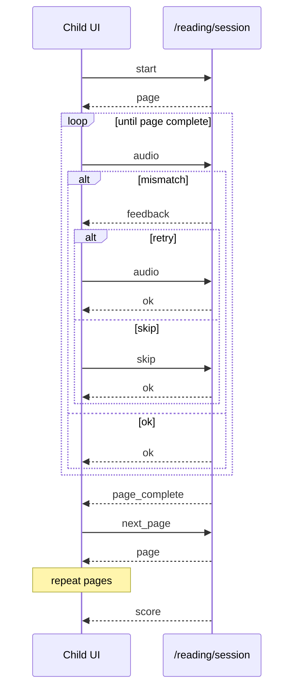

# WebSocket reading session

**URL:** `ws://localhost:8080/reading/session` (use `wss://` in production)  
Implementation: [`reading.py`](reading.py)

Recommended for the child reading UX. The server tracks cursor and score tallies.

All messages are **JSON text frames**.

## Client → server

| `type` | Payload | When |
|--------|---------|------|
| `start` | `{ "type": "start", "doc_id": "...", "page_number": 1 }` | Begin session |
| `audio` | `{ "type": "audio", "data": "<base64 utterance>" }` | Child finished speaking |
| `skip` | `{ "type": "skip" }` | After `feedback` — advance past the wrong word without credit |
| `next_page` | `{ "type": "next_page" }` | After `page_complete` on non-last page |
| `end` | `{ "type": "end" }` | End session and get score |

`page_number` defaults to `1` if omitted on `start`.

## Server → client

| `type` | When |
|--------|------|
| `page` | After `start` or `next_page` — includes `content`, `image_url`, `page_number`, `pages_total` |
| `ok` | Utterance correct, more words remain — includes `cursor` |
| `feedback` | One or more wrong words — includes `mismatches[]` and `cursor` at the first unresolved word |
| `page_complete` | Page finished (not last page) |
| `score` | Book finished or `end` / `next_page` on last page |
| `error` | Invalid state or missing resource |

### Scoring (WebSocket)

`words_total` counts words **resolved** (moved past), not speech attempts.

| Outcome | `words_total` | `words_correct` | Extra |
|---------|---------------|-----------------|-------|
| Correct first try | +1 | +1 | — |
| Wrong, then correct on retry | +1 | +1 | `words_retried_correct` +1 |
| Skip after feedback | +1 | +0 | `words_skipped` +1 |

`accuracy = words_correct / words_total`. Retries that succeed get full credit; skipping is the accuracy penalty.

### `page`

```json
{
  "type": "page",
  "doc_id": "550e8400-e29b-41d4-a716-446655440000",
  "page_number": 1,
  "content": "مرحبا بكم في قصتنا",
  "image_url": "https://storage.googleapis.com/...",
  "pages_total": 2,
  "has_text": true
}
```

`image_url` is a signed URL to a cached PNG of the PDF page (rendered on first request, stored at `page_images/{doc_id}/{page_number}.png`). It may be `null` if rendering fails or the format is unsupported. `content` remains available for word-level grading and progress UI.

### `feedback`

```json
{
  "type": "feedback",
  "mismatches": [
    {
      "index": 0,
      "expected": "مرحبا",
      "heard": "مرحب",
      "start": 0.0,
      "end": 0.48
    }
  ],
  "cursor": 0
}
```

After `feedback`, the client may send another `audio` (retry) or `{ "type": "skip" }` to continue without fixing the word.

### `score`

```json
{
  "type": "score",
  "doc_id": "550e8400-e29b-41d4-a716-446655440000",
  "words_total": 42,
  "words_correct": 38,
  "words_skipped": 4,
  "words_retried_correct": 6,
  "pages_completed": 2,
  "pages_total": 2,
  "accuracy": 0.9048
}
```

Show on your score screen. No need to call `POST /reading/finish` when using WebSocket through completion.

## Sequence



On the **last page**, completing the page via `audio` or `skip` emits `score` directly (no `page_complete`).

## Minimal browser example

```javascript
const ws = new WebSocket("ws://localhost:8080/reading/session");

ws.onopen = () => {
  ws.send(JSON.stringify({
    type: "start",
    doc_id: "550e8400-e29b-41d4-a716-446655440000",
    page_number: 1,
  }));
};

ws.onmessage = (event) => {
  const msg = JSON.parse(event.data);

  switch (msg.type) {
    case "page":
      renderPage(msg.image_url, msg.content, msg.page_number, msg.pages_total);
      break;
    case "feedback": {
      const m = msg.mismatches[0];
      if (m?.start != null && m?.end != null) {
        playWordClip(pageAudio, m.start, m.end); // or play full pageAudio
      }
      // show Try again + Continue; Continue sends skip
      break;
    }
    case "page_complete":
      ws.send(JSON.stringify({ type: "next_page" }));
      break;
    case "score":
      showScoreScreen(msg);
      break;
    case "error":
      console.error(msg.message);
      break;
  }
};

function sendUtterance(base64Wav) {
  ws.send(JSON.stringify({ type: "audio", data: base64Wav }));
}

function skipWord() {
  ws.send(JSON.stringify({ type: "skip" }));
}

function playWordClip(audioEl, start, end) {
  audioEl.currentTime = start;
  audioEl.play();
  const stop = () => {
    if (audioEl.currentTime >= end) {
      audioEl.pause();
      audioEl.removeEventListener("timeupdate", stop);
    }
  };
  audioEl.addEventListener("timeupdate", stop);
}
```

## Related

- [POST reading API](reading.md)
- [WebSocket errors](../../docs/frontend/errors.md#websocket)
- [WebSocket UI flow](../../docs/frontend/flows.md#child-reading-flow-websocket--recommended)
